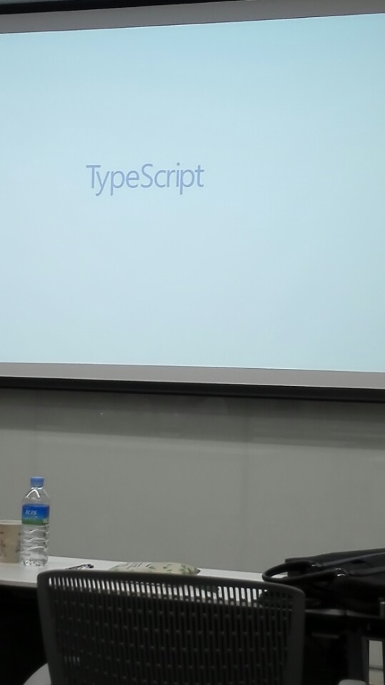

# 2017-06-03
<h2>About with TypeScript</h2>
ppt를 사용해서 발표를 했다. 
main color를 파란색으로 했다. 

 
TS의 장점은 JS의 사소한 버그를 줄일 수 있다. 
JS는 Data Type을 정의하지 않는데, TS는 Data Type을 정의한다. var a:number 
TS는 JS 코드를 객체지향적으로 짜는데 도움을 주고 이외에도 여러가지 도움을 준다. 
컴파일하면 JS로 변환된다. 

<h2>Mobile Application With Ionic2 and TypeScript</h2>
하이브리드 앱을 제작하는 세션이다. 
<h3>Ionic2</h3>
cordova프레임워크 위에서 작동한다. 
angular2와 TS를 사용한다.(JS 사용 가능) 
스마트폰에 최적화된 ui를 제공하고, HTML을 사용한다. MVC패턴으로 분리해서 개발이 가능하다. 
단점은 느리다. 

npm을 이용해 설치하는데, 환경이 안좋아서 실습은 해보지 못했다. 

<h2>About with TypeScript with Electron and TypeScript</h2>
Angular with TS로 electron을 개발했다. 
<h3>Electron</h3>
Electron은 Chronium과 Node.js를 사용해 Desktop 앱을 HTML,CSS,JS로 쉽게 개발할 수 있게 해주는 Framework다.

MS의 FaceAPI를 사용해 라이브코딩을 진행했는데, 대학생 분들이라 그런지 에러도 많이났고, 그로인해 시간도 많이 소요됐다. 
나중에 JS공부를 끝내면 TS도 해봐야 겠다는 생각이 많이 들었다.ㄱ

<h3>본 행사는 Microsoft에서 운영하는 Microsoft Student Partners 대학생 단체에서 진행하는 행사로 Microsoft 본사에서 주최하는 공식적인 행사는 아닙니다.</h3>
