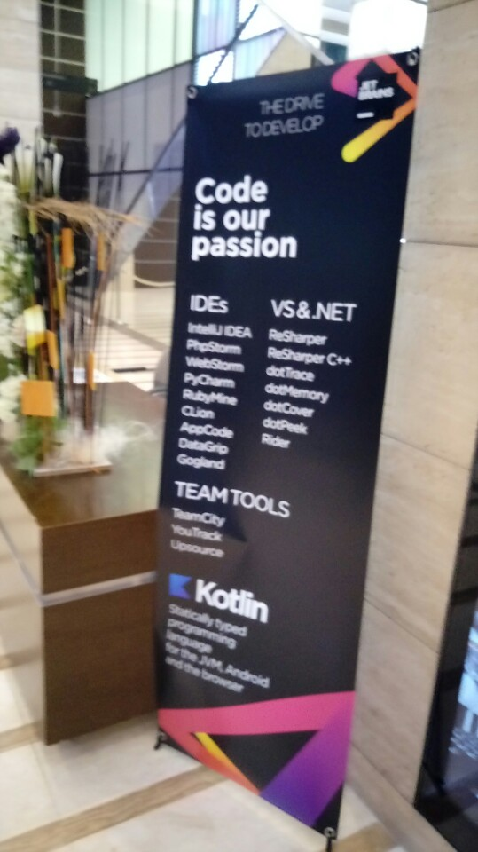

# 2017-11-21
## IntelliJ IDEA 기반 IDE Tips & Tricks
하디 하리리가 인텔리제이 기반 IDE의 팁이랑 쓰는방법을 알려줬다.

중간중간에 joke도 하고 재밋었다.

1. Tool Box에서 여러가지 세팅이 가능하다.(여러 IDE)
2. !=가 다르게 표시된다 ===도
3. 인텔리제이 제품들은 빠른 검색이 된다.
4. #plugin으로 플러그인도 설치가 된다.
5. Double Shift로 여러가지가 가능하다.
6. cmd + E 로 Recently File을 열 수 있다.
7. control + shift + space bar로 자동완성이 된다.
8. Analyze가 변수의 사용되는곳을 추적해준다.
9. Search Template로 검색이 가능하다.(코드라인 제한도 가능)
10. 사용자가 Warning문법을 만들 수 있다.
11. Replace도 가능(Warning인거)
12. variable도 warning가능
13. Debug가 강력하다.
14. Test Restful 사용가능
## 지속적인 작업 흐름(JetBrains 팀툴)
git이나 다른걸 안 써도 빌드 자동 또는 협업이 가능하다.

HUB, TC, VS 등등
## Break Time
저녁을 나눠줌.

쿠키와 샌드위치, 과일 그리고 커피

난 커피를 안 마셔서 커피를 안마심
## Kotlin 102 - Beyond the basics
하리리의 코틀린 설명이 이어졌는데,

아주 유쾌하고 재밋었다.

근데 난 코틀린을 잘 몰라서 대강 듣기만 했다.
## 후기
끝나고 하리리랑 사진찍고 싶었는데,

VIP룸에 들어간거 같아서 못 찍었다. ㅠㅠ

