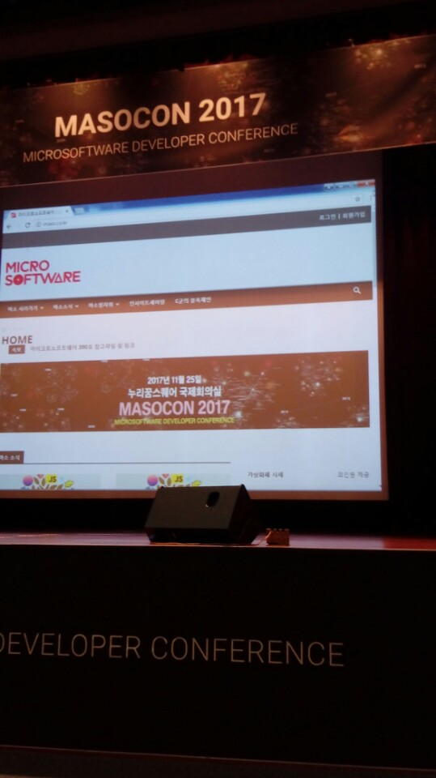
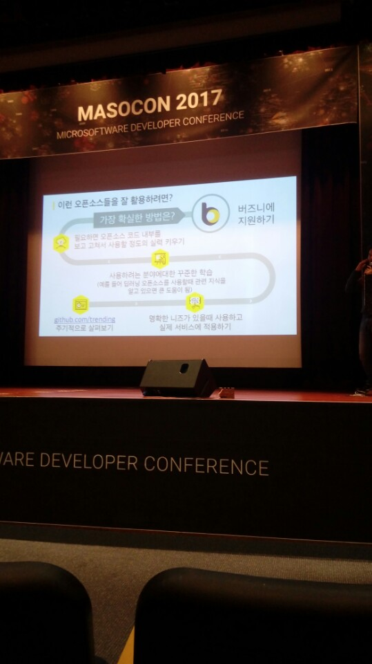
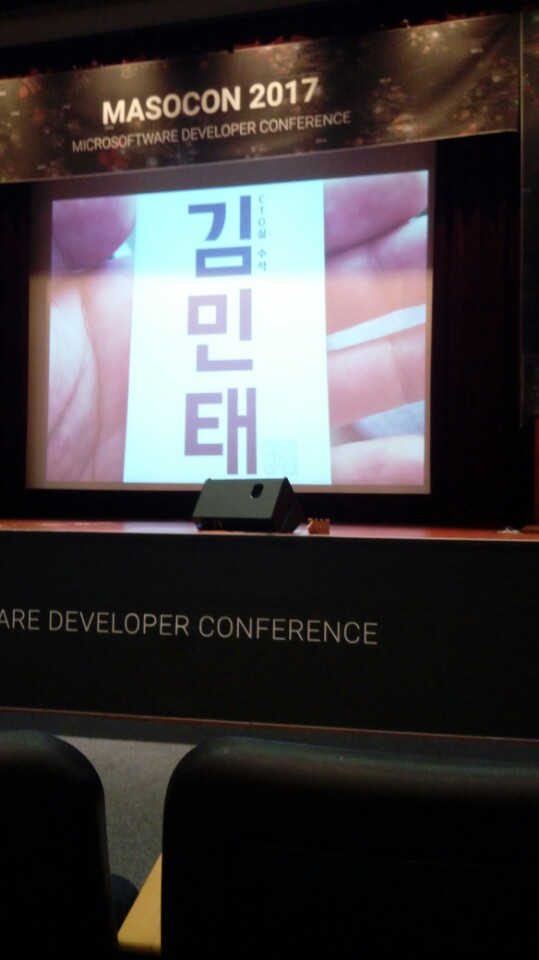
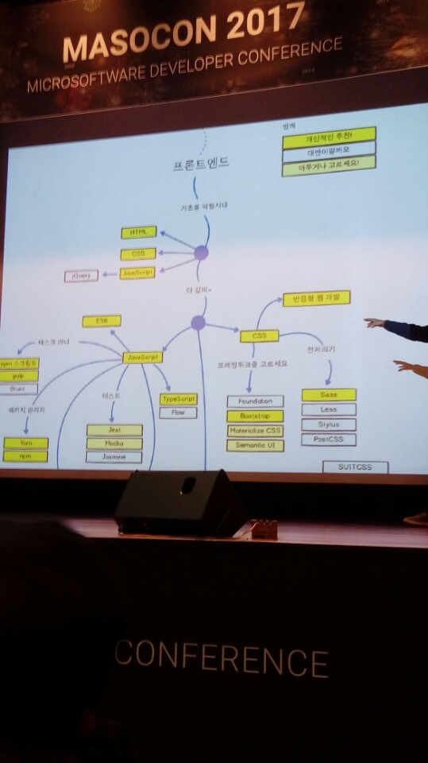
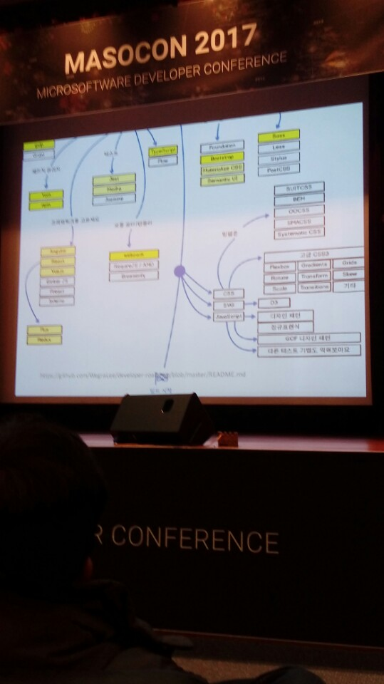

# 2017-11-25
## 개회사 : 공재웅 운영진(모의침투연구회)
다음회에는 맥주를 마시면서 즐겨보자.
## 우아한 오픈소스 : 김민태 수석(우아한형제들)
웹 프론트엔드 개발자.

### 왜 우아한형제들에선 WoowahanJS를 만들었을까?

문제를 정의했다.

현실 :

1. 웹퍼블리셔(HTML, CSS, Image Cutting)
2. 프론트앤드 개발자

아키텍쳐는 Micro로 나눠야된다.

나누다보니 API를 제공하게 되고, Framework나 Library를 사용하게 됨

해법 : Js

### 근본적인 질문

웹 앱의 종류 ?

1. B2C Web App
    * 잦은 UI 업데이트
    * 복잡하고 디테일한 UI 구성
    * 트랜드에 민감한 UX
    * 재사용륭 1.5%
2. Backoffice Web App
    * 단순한 CRUD 구조
    * 재사용륭 높은 UI
    * 촉박한 갭라 일정
    * 쉽게 확장되는 스케일

웹 앱은 무엇을 하는거?

Template String + Date => HTML String

### Long Term Road Map 을 중요하게 생각해라
## 오픈소스를 활용한 AI기반 검색 서비스 구축기
### 기술을 고도화 시키기전에 사용자들의 반응을 살펴라.

Elasticsearch 라는 것을 사용한다.

세그멘터 뿐만 아니라 성능평가를 해야된다.

성능평가를 할 때, 엔진의 성능이 좋은지, 안 좋은지 판단할 기준점이 필요

### 카테고리를 분류하는 System을 만들어야 된다.

노트북을 검색하면 노트북 받침대가 최상위에 나오기 때문

딥러닝을 하는 엔진을 제작한다.

### 이미지 인식 검색 기술을 개발했다.

Feature들을 뽑아서 검색

torch, Faster RCNN을 사용

### github.com/trending 을 주기적으로 살펴봐라]
## Lightning Talk
### Hanjp Input Method (한국어 -> 일본어) 오픈소스
### Open SUSE?
### OPEN STACK(이건 나중에 확인해보자)
### 추억의 Js
## React.js에 반응하라
원래 React = React.js

유명해지니까 React가 됐다.

### React의 장점
Virtual DOM

Before After만 비교해서 바뀐 부분만 적용하는 방식
### Data Flow
* React는 단방향 데이터 흐름
* 주어진 데이터가 같으면 항상 같게
* 단순한 데이터여서 예측하기 쉬움
### JSX
JS 안에 XML
### Component
* 재사용 하는 UI덩어리
* 라이프사이클
* 부모에서 자식에 데이터를 보냄
### React가 해주는 것
* 뷰(Redux를 사용해야 상태관리가 가능하다.)
## Electron, Typescript, 성공적
일렉트론 주소 : electronjs.org

macOS, Windows, Linux 가능

프레임워크다.
### History
* Node.js와 Webkit을 연결하고자 노력했다.
* 'Cheng Zhao'가 인텔에서 인턴하면서 프로젝트에 참여
* 'Cheng Zhao'가 깃헙으로 가서 Atom Editor를 만들기 위해 엔진을 개발
* Atom Shell -> Electron
* MS에서 Electron을 사용해 VSCode를 만들면서 본격적으로 인기를 얻음
### 장점
* 빠르게 프로젝트가 성장
    * 개발속도가 빠르다.
    * 버그 수정도 빠르다.
    * 크로미움과 노드의 업뎃에 맞춰 빠르게 수정된다.
* 잘 관리되고 있는 써드 파티 커뮤니티가 함께 성장하고 있다.
* 다수 유명프로젝트가 사용
    * 자동업데이트, 설치, 배포
    * VS Code도 오픈소스니까 보고해라
### 단점
* 앱을 만들지도 않았는데, 100MB가 넘는다.
* 리소스를 많이 먹는다.
* 윈도우에서 사용이 상대적으로 불안정하다.
* 소스보호를 하지 않음(디컴파일)
### 프로토파이를 Electron으로 한 이유
* 어마어마한 UI 레퍼런스
* 미리 만들던 웹 서비스용 코드
* 크로스 플랫폼
### 일렉트론 문법
* ES6
* async-await도 포함
## R로 만드는 API서버 삽질기
### 의사결정을 위한 데이터 분석 프로젝트의 단계
1. 데이터 확보
2. 전처리
3. 모델링
4. 시각화
5. 문서화
### 머신러닝 프로젝트의 단계
1. 데이터 확보
2. 전처리
3. 모델링
4. **제품화**
Micro Service Architecture 면 제품화하기 쉽다.

작은 API서버?

Micro Service Architecture -> Serverless
## 협업으로 달라붙고, 빌드 자동화로 편해지자
Github를 사용해 PR Code Review 등등 하고,

빌드는 Travis CI를 사용해봤다.
### 서버 분류
* 개발 서버
* 운영 서버
* 스테이지 서버
개발 서버 -> 스테이지 서버 -> 로드밸런싱 -> 운영 서버

로드밸런서 http://d2.naver.com/helloworld/605418
## 오픈 소스 라이선스와 컴플라이언스
라이선스는 배포버전을 올릴 때 라이선스를 변경할 수 있다.
## 개울가의 올챙이 한마리, 꼬물꼬물 헤엄치다
### 삽질들
1. 이미 있는 DB Tool과 싸워야 된다.
## 데이터 정의로 밝힌 내 삶의 햇볕
에피소드로 설명해준다.
### 백업
처음에 규모가 작을 땐 로컬 디스크를 사용했다.

커지면 Local Disk -> NAS

너무 커져서 무리가간다.

해결책 : 매일 다른 NAS에

스케쥴링 : 맥시멈 사이즈를 정하고 넘지않게함.(동시에 3개이상 1개의 NAS에 저장하지 않음)
## Lossless Replication
마스터/슬레이브 간 **데이터가 틀어**질 수 있다.

마스터 장애 시 **데이터 유실**이 발생할 수 있다.

슬레이브 : 비동기로 데이터를 로컬에 복제하며, 굳이 서비스에 포함되지 않아도 되는 것

데이터 복제 : 마스터에서만 서비스하는 상황에서의 피할 수 없는 비동기 데이터 복제

1초마다 transaction log -> RAM -> DISK
## 후기
오늘 피젯큐브, 블루투스 스피커, 마소 잡지 받음

음 세션들을 자세히 보지 않았지만, 마이크로소프트 디벨로퍼 컨퍼런스여서 C, C++, C# 같은 내용이 많을줄 알았다.

졸린데 라이선스에 대한 설명을 들으니 졸을뻔했다.

결론적으로는 다른 컨퍼런스 같은 경우는 발표하시는 분들이 계속 발표를 한다.(같은 내용을 어딜가도 들음)

근데 이번 MASOCON은 새로운분을 많이 뵌거같다.

