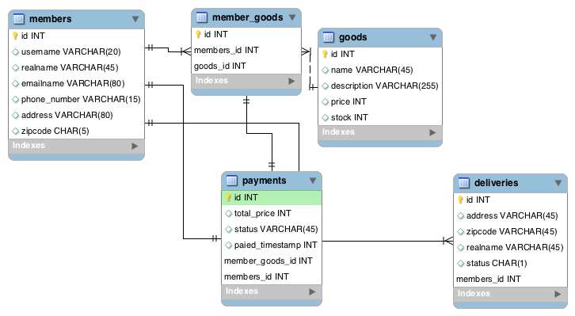
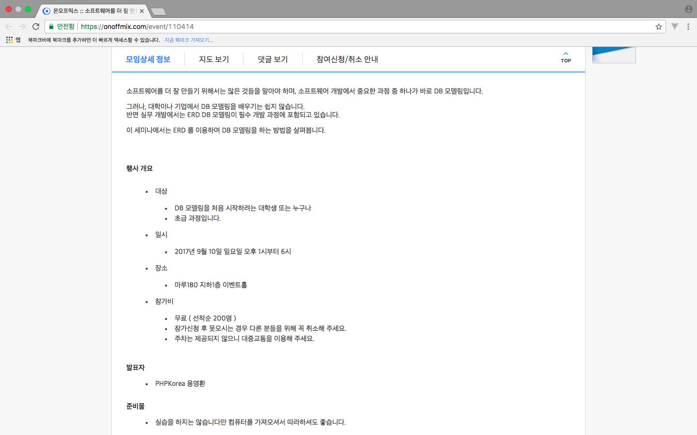
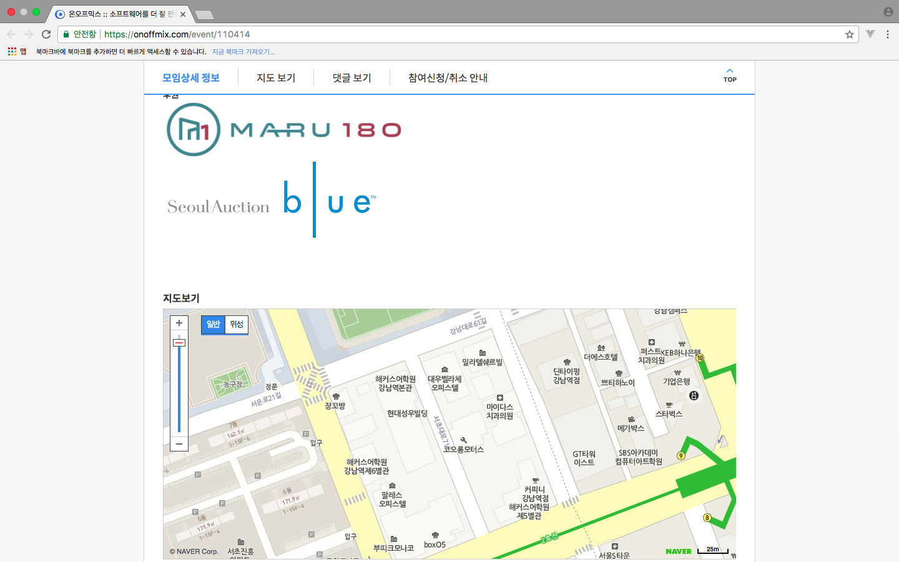

# 2017-06-25
<h2>MS의 Machine Learning</h2>
MS에서 후원한 세미나여서 광고 형식으로 세션이 하나 추가됐다. 
김대우 부장님이 진행했고, sqler.com의 제작자다. 
Machine Learning은 수학공식을 많이 사용하고 어려운게 아니라고 한다. 
 
Machine Learning의 영역은 통계적 방법, 데이터마이닝 등 기존 분석기법들을 포괄한다. 
 

많이 사용되는 언어
<ul>
    <li>python</li>
    <li>R</li>
</ul>
<h3>python의 장점</h3>
개발자에게 친숙하다.
<h3>R의 장점</h3>
아주 큰 규모로 이미 자리를 잡았다.

MS의 Cloud Machine Learning서비스는 이미 만들어진 것을 돈울 지불하고 사용할 수 있다. 
Machine Learning을 하는 이유는 예측을 받기 위해서다. 
모든 기술에 필요충분 조건이 될것이다. 
 
실제로 게임기업들은 유저의 이탈율을 낮추고 수익을 극대화 시키는데 사용한다. 
Azure Machine Learning Studio는 무료로 체험이 가능하다. 

<h2>ERD를 이용한 DB 모델링</h2>
프로그램의 본질은 데이터다. 
데이터의 흐름을 제어하기 위해 프로그램을 만든다. 
소프트웨어를 해부하면 크게 도장과 데이터로 나눌 수 있다. 
모델은 데이터의 고나계 흐름등을 추상화한 모형이다. 
소프트웨어 모델링은 객체나 DB를 그림으로 표현하는 것이다. 
장점 :
<ul>
    <li>만들고자 하는 바를 명확하게 알 수 있다.</li>
    <li>조금 더 잘 만들 수 있다.</li>
    <li>이해하고 소통하기 편하다.</li>
    <li>면접을 볼 때 좋다.</li>
    <li>보여줄 때 좋다.</li>
    <li>만들고나면 뿌듯하다.</li>
    <li>RDBMS의 설계까 쉬워진다.</li>
</ul>
툴은 대표적으로
<ul>
    <li>ER-win</li>
    <li>Mysql Workbench</li>
</ul>
가 있는데, Workbench는 사용하고, ER-win은 사용을 안해봤다. 
<h3>erd</h3>
ERD에는 식별자가 있다. 
ERD Symbol을 검색하면 나온다. 
모델링에서는 DB를 Schema라고 부른다. 

<strong>정규화란?</strong>관계형 데이터베이스의 설계에서 중복을 최소화하게 데이터를 구조화하는 프로세스를 정규화라고 한다. 그리고 다시 되롤리는 것을 역정규화라 한다. 

실습 : 

