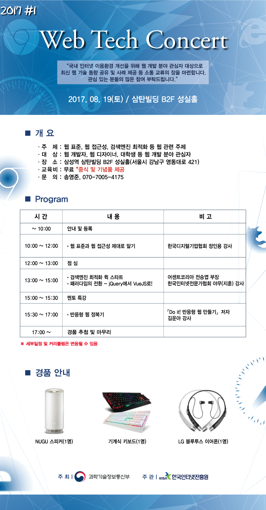

# 2017-08-19
<h2>웹 표준성</h2>
2010년엔 internet explorer가 거의 독점함. 
IE가 W3C에 동참을 안했음. 그로인해 Cross Browsing이 힘들었음. 
<h3>ActiveX</h3>
마이크로소프트에서 개발한 응용프로그램과 웹을 연동시키기 위해 제공되는 기술 
<strong>단점 :</strong>
<ul>
    <li>기술종속</li>
    <li>보안 취약성</li>
    <li>서비스 이용제약 : 멀티브라우저 미 지원</li>
    <li>호환성 제약 : 새로운 디바이스 (폰, 테블릿) 미지원</li>
</ul>
2006년 PC월드의 '전대 미문의 최악의 기술' 25위 중 8위에 선정됨 
그 후 IT시장의 큰 변화가 생김(Phone) 
Steve Jobs가 플래시 지원을 중단함(모바일 배터리나 취약점 등등 때문에) 
2020년에 Adobe가 Flash를 중단하겠다고 함. 
Flash중단을 선언하고, JS의 개발자가 급증함 
2016년 2월 전세계 웹 브라우저 점유율 
<ol>
    <li>Chrome</li>
    <li>IE</li>
</ol>

차세대 신기술인 HTML5 등장함 (2014년 10월 28일 표준 확정) 
HTML5 CSS JS를 사용해 웹을 제작함 
새로운 기능 :
<ul>
    <li>동영상이나 음악 재생 (Vidoe, Audio)</li>
    <li>2D (Canvas), 3D (WebGL,OpenGL)</li>
    <li>오프라인에서 작동함</li>
    <li>도메인 간의 통신 구현 (Web Socket)</li>
    <li>Client측 데이터장저장(Web Storage, Web SQL DB 등)</li>
    <li>백그라운드 처리 수행</li>
    <li>로컬 파일의 내용 읽어드림 (File API)</li>
</ul>
AcitveX를 사용하지 않아도 된다. 
<strong>논리적인 시맨틱한 마크업</strong> 
header nav section article aside footer 
CSS3의 media query를 이용해 다양한 device에 맞춰진 화면 제공 

[호환성](http://html5test.com) 
[호환성](http://caniuse.com) 
웹표준 준수시 장점 :
<ul>
    <li>수정 운영관리 용이</li>
    <li>검색엔진 최적화</li>
    <li>효율적인 마크업</li>
    <li>호환성 가능</li>
    <li>접근성 향상</li>
</ul>
<h2>웹 접근성</h2>
장애인과 비장애인 모두 웹 접근이 가능해야 한다. 
스크린 리더기는 브라우져가 모두 호환이 안되는 경우도 있다. 
웹 접근성을 어기면 많은 벌금을 낼 수 있다. 
<h3>웹 접근성 분석 도구</h3>
<ul>
    <li>Open-WAX (무료)</li>
    <li>Wave (무료)</li>
    <li>beX (유료)</li>
    <li>A=CoolCheck! (유료)</li>
</ul>
<h2>웹 접근성 지침</h2>
<ul>
    <li>인식의 용이성</li>
    <li>운용의 용이성</li>
    <li>이해의 용이성</li>
    <li>견고성</li>
</ul>

[자세히 보기](http://www.websoul.co.kr/accessibility/WA_guide21.asp) 
WAI-ARIA를 사용하면 스크린 리더기에서 쉽게 읽게 html을 짤 수 있음. 
우리나라에서 약 200명 중 1명은 시각장애인 이라고 한다. 

<h2>검색엔진 최적화 퀵 스타트</h2>
검색엔진 최적화 : 각종 검색엔진에 내 글을 효과적으로 싣고 널리 알릴 수 있또록 웹 페이지를 구성해서 검색 결과의 상위에 오르게 하는것이다.[네이버 백과사전]  
검색엔진 최적화를 하면 상위권에 뜬다. 
<ul>
    <li>TEXT VOLUM
        <ul>
            <li>개별 페이지는 350단어 이상(1000글자 이용) 사용</li>
            <li>텍스트 정보를 이미지로 만들어 작성하는 것은 지양</li>
            <li>핵심 단어의 본문 내 출연율을 확보</li>
            <li>개별 소주제별로 H Tag를 사용</li>
            <li>적절한 이미지와 동영상을 함께 구성</li>
        </ul>
    </li>
    <li>THEME
        <ul>
            <li>1개의 주제에 대한 1개의 URL을 보유한 형태로 웹사이트를 기획하고, 특정 페이지 내 요약된 포인트들에 대한 세부 페이지를 제공</li>
            <li>개별 주제에 대한 명확한 세부 페이지를 가져야 타이틀/페이지 최적화 가능</li>
        </ul>
    </li>
    <li>URL
        <ul>
            <li>URL은 검색 결과에서의 노출 경쟁력만이 아닌 유저 사용성에도 영향을 주는 요소</li>
            <li>URL들이 서로 겹치지 않고 유니크하면서, 적정 같이 내에서 개별 페이지의 내용을 제대로 묘사하도록 구성하는 것이 중요</li>
            <li>파라매터로 이루어진 URL보다 단어로 이루어진 URL을 사용하는게 좋음</li>
        </ul>
    </li>
    <li>IMAGE
        <ul>
            <li>이미지 File Name을 작성시 이미지 정보가 담겨있는 파일 네미잉르 가질 수 있도록 설정</li>
            <li>이미지 안에 중요한 텍스트를 포함하지 않도록 하고, 이미지에 대해 가능한 정보를 Alt로 제공</li>
        </ul>
    </li>
    <li>GNB and FOOTERLINK(NAVIGATION)
        <ul>
            <li>GNB에 사용되는 메뉴얼은 텍스트로성작성</li>
            <li>관련 링크는 Full URL로, 제공하는 페이지를 정확히 설명하도록 앵커 텍스트를 사용</li>
            <li>관련 링크 사용시 자바스크립트는 사용하지 말것</li>
            <li>GNB/Sub-GNB 에서 제공이 어려운 컨탠츠의 경우 Footer를 활용하여 엑세스 경로 제공</li>
        </ul>
    </li>
    <li>Breadcrumbs(LINK)
        <ul>
            <li>Breadcrumbs를 이용해 유저와 검색엔진에게 해당 페이지의 경로와 위치를 알려주도록 설정</li>
        </ul>
    </li>
    <li>SNS Share(LINK)
        <ul>
            <li>개별 페이지 마다 Facebook/Twitter 등 소셜 미디어로 바로 공유할 수 있도록 버튼을 설치하는 것은 컨텐츠 확산에 도움</li>
        </ul>
    </li>
    <li>Responsive(Mobile)
        <ul>
            <li>반응형 웹으로 전체 웹사이트를인디자인</li>
            <li>모바일 웹을 별도로 제작 시 유저 에이전트팅 세팅</li>
            <li>모바일 비추천 기술 사용하지 않도록</li>
        </ul>
    </li>
    <li>AMP(Mobile)
        <ul>
            <li>AMP로 컨버팅하면, 퍼포먼스가 좋아져서 검색엔진 상위에 노출될 수 있음</li>
        </ul>
    </li>
    <li>Title Description(Keywords)
        <ul>
            <li>페이지 내용을 명확하게 소개하는 문구를</li>
            <li>클릭을 유도하는 매력적으로 작성</li>
            <li>Title은 모든 페이지가 달라야 됨</li>
        </ul>
    </li>
    <li>&lt;H1&gt; TAG (HEADING TAG)
        <ul>
            <li>개별 페이지의 컨탠츠 제목에 컨탠츠의 주제를 명확히 설명하자</li>
            <li>제목에 대해 1회만 사용을 권장</li>
        </ul>
    </li>
    <li>&lt;H2&gt; TAG (HEADING TAG)
        <ul>
            <li>H1 뿐만 아니라 H2~H6을 적극적으로 사용</li>
            <li>이미지, 동영상이 아닌 텍스트로 사용</li>
        </ul>
    </li>
    <li>OG: OPEN GRAPH(SNS)
        <ul>
            <li>OG 설정은 유저들의 SNS르 통한 컨탠츠 공유 시 미리 설정해준 타이틀/설명문/이미지를 노출 시킴</li>
            <li>이미지의 경우 적정 사이즈를 사용한것이 가장 유리</li>
        </ul>
    </li>
    <li>SCHEMA(SNS)
        <ul>
            <li>기본적으로 모든 페이지에 Name,URL,Description,Keywords,image를 적용함</li>
            <li>Breadcrumbs 적용 시 적절한 Schmea.org</li>
        </ul>
    </li>
    <li>Robots and Meta robot(INDEX)
        <ul>
            <li>Robots.txt를 통해 웹사이트 전반의 색인 허용 페이지와 색인을불허할 페이지를 구분해 설정</li>
            <li>Meta Robot과 같은 HTML코드를 이용해 개별 페이지에 대해서 해당 페이지에 대한 색인 허용/불허 설정히 가능함</li>
            <li>개인정보가 담긴 페이지 등 색인되지 말아야 할 페이지는 초기에 Meta Robot 태그를 통해 색인 불허 설정 필수</li>
        </ul>
    </li>
    <strong>SEO Tools : EYEBE.AM, similarweb, ahrefs</strong>
    
</ul>

<h2>패러다임의 시프트(인식의 전환) - jQuery에서 VueJS로!</h2>
Algorithm / Data Structure 에서 Design은 설계의 의미다. 
Back은 외주로 맡기고, Front만 잘 해도 비싸게 팔린다. 
프레임워크를 사용하게 된 순서 :
<ol>
    <li>Native는 작업하는데 오래걸림</li>
    <li>Library를 사용하면 퍼포먼스가 안좋음</li>
    <li>Framework는 대부분 퍼포먼스가 좋음</li>
</ol>
Virtual DOM을 사용하면 해박한 지식이 필요하다. 
jQuery의 addClass를 사용안하고 Native의 addClass를 사용해라. 
vue-cli를 사용하면 통합 개발 환경이 갖춰진다. 

<h2>반응형 웹 정복기</h2>
반응형 웹 : 모든 Device 또는 화면에서 반응한다. 
시대가 발전하면서 IOT가 발전하고 있다. 
다양한 Device가 나오면서 대응해야 될게 많아진다. 
<h3>가변 그리드</h3>
가변 : 변하다. 
<h3>Fluid Grid == Flexible Grid</h3>
px을 사용하지 않고 %를 사용한다. 
<h3>공식 : 가변적인 요소로 만들 요소의 길이 / 부모 요소의 가로 길이 * 100</h3> 
요소가 가변적으로 변경됨에 따라 마진과 패딩도 가변적이어야 된다. 
가변 그리드와 동일하게 무조건 % 
<h3>공식 : 가변적인 마진,패딩 / 부모 요소의 길이 * 100</h3>
대표적인 상대 단위 : em 
상속 문제 때문에 rem을 사용하자 
rem은 html을 기준으로 상속한다. 
가변 단위 : 
<ul>
    <li>vw</li>
    <li>vw</li>
    <li>vmin</li>
    <li>vmax</li>
</ul>
vw : 보이는 영역의 너비를 100을 기준으로 하여 크기 결정 

[vw](1.html) 
vh : 보이는 영역의 높이를 100을 기준으로 하여 크기 결정 

[vh](2.html) 
vmin : 보이는 영역의 너비와 높이중 작은 길이를 선택 
vmax : 보이는 영역의 너비와 높이중 큰 길이를 선택 

[vh](3.html) 
너빗값과 최대 너빗값을 100%로 설정한다. 
높잇값은 자동. 
콘텐츠를 가져다 쓸 때 비율이 깨질 때가 있다. 
유튜브나 비메오 같은 멀티미디어 제공업체의 콘텐츠는 거의 16:9 비율이다. 
16/9*100=패딩 
<h3>미디어 쿼리</h3>
미디어에게 또는 기기에게 질문한다(query). 

    @media [미디어 유형][and 또는,](조건문){실행문}
<h3>Viewport</h3>
실제로 보이는 화면 
실제 기기의 디스플레이 화면크기와 Viewport 영역을 동일하게 

    <meta name="viewport" content="width=device-width,initial-sclae=1,minimum-scale=1,maximum-scale=1,user-scalable=no">
<h3>flexible box</h3>
확장성 있는 박스 또는 확장에 능통한 CSS속성 
주축과 교차축이 있다. 

    display: flex or inline-flex
    flex : 박스를 블록 수준의 플랙서블 박스로 작동한다.
    flex-inline : 박스를 인라인 수준의 플랙서블 박스로 작동한다.
    flex-direction: row or row-reverse or column or column-reverse
    flex-wrap: nowrap or wrap or wrap-reverse
    flex-flow: [flex-direction] [flex-wrap]
    align-self : 요소 하나만을 배치할 때
    order: 배치 순서 바꾸기
브라우저의 지원을 많이 안한다. 
<h3>SVG</h3>
확대해도 깨지지 않고, 벡터 그래픽 방식 
실사 이미지가 아닐 경우 사용, 일러스트에서 제작 가능 
실사 이미지는 &lt;picture&gt;태그를 사용.

